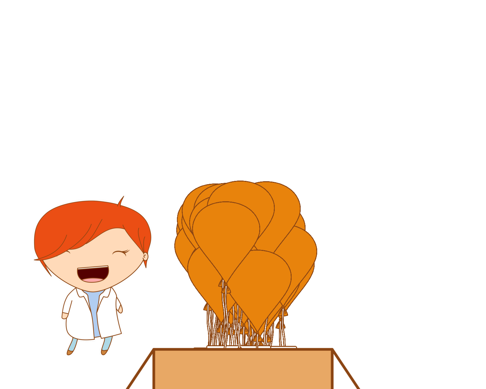

Make a gif with balloons for Steph's 31th birthday
===================================================

You'll need

* to delete the content of balloons/ and tags/.

* Use [make_lotto.R](make_lotto.R)

* `rtweet` and all the token stuff.

* `magick`, `tweenr`, `glue`, `ggplot2`, `ggimage`, `stringr`, `purrr`, `fs`, `magrittr`, jeroen/`gifski`.

* to get winners run `paste0("The winners are ", toString(winners))`, it's a line in the script actually.
